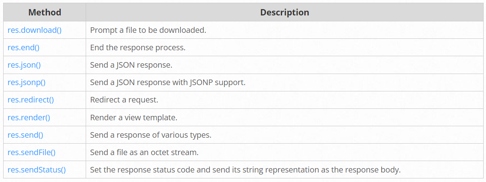

# Response Method

<table>
    <tr>
        <th>Method</th>
        <th>Description</th>
    </tr>
    <tr>
        <td>res.download()</td>
        <td>prompt a file to download</td>
    </tr>
    <tr>
        <td>res.end()</td>
        <td>end the response process</td>
    </tr>
    <tr>
        <td>res.json()</td>
        <td>send a json response</td>
    </tr>
    <tr>
        <td>res.jsonp()</td>
        <td>send a json response with jsonp support</td>
    </tr>
    <tr>
        <td>res.redirect()</td>
        <td>redirect the request</td>
    </tr>
    <tr>
        <td>res.render()</td>
        <td>render a view template</td>
    </tr>
    <tr>
        <td>res.send()</td>
        <td>send response of various type</td>
    </tr>
    <tr>
        <td>res.sendFile()</td>
        <td>send a file as octet stream</td>
    </tr>
    <tr>
        <td>res.sendStatus()</td>
        <td>set a response status code and send its string representation as a response body</td>
    </tr>
</table>

## Response Method
