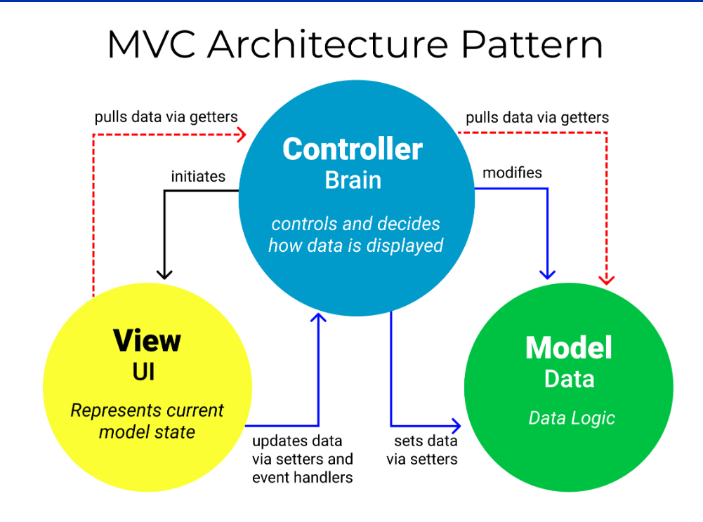

# MVC Architecture

The MVC Architecture turns the complex application development into much more managable process, allows multiple developers to work on the same application simultaneously.

### What is MVC ?

MVC stands for model-view-controller. 

- Model: The backend that contains all the data logic

- View: The frontend or Graphical User Interface (GUI)

- Controller: The brain of the application that connects the Model (backend) with View (frontend)

