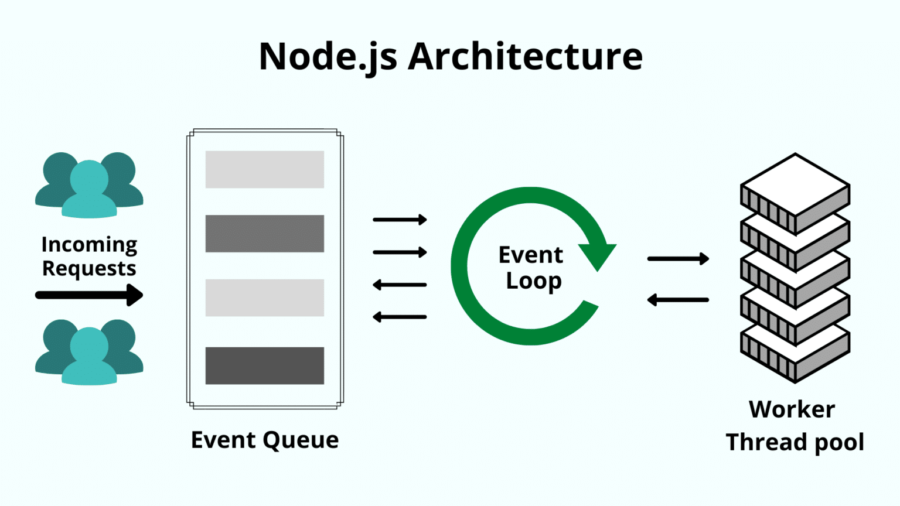
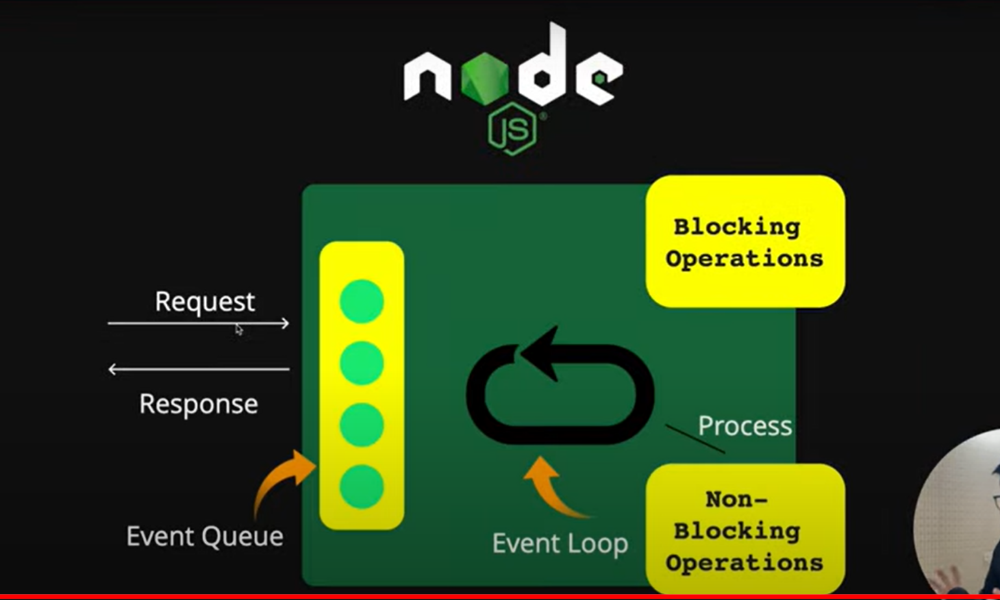
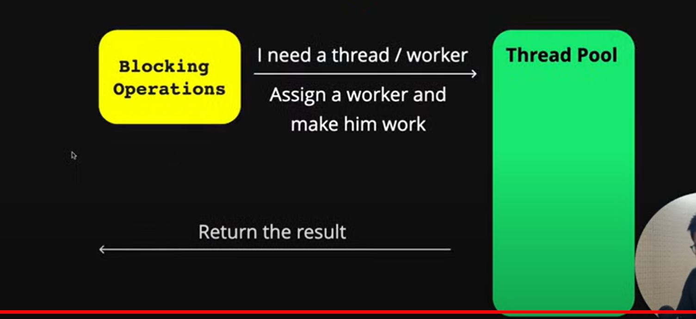

# How NodeJS works

Node.js uses the “Single Threaded Event Loop” architecture to handle multiple clients at the same time.

### NodeJS working
Node.js works differently. Let’s take a look at each step it goes through:

1. Node.js maintains a limited thread pool to serve requests.
2. Whenever a request comes, Node.js places it into a queue.
3. Now, the single-threaded “Event loop”—the core component—comes into the picture. This event loop waits for requests indefinitely.
4. When a request comes in, the loop picks it up from the queue and checks whether it requires a blocking input/output (I/O) operation. If not, it processes the request and sends a response.
5. If the request has a blocking operation to perform, the event loop assigns a thread from the internal thread pool to process the request. There are limited internal threads available. This group of auxiliary threads is called the worker group.
6. The event loop tracks blocking requests and places them in the queue once the blocking task is processed. This is how it maintains its non-blocking nature.

Since Node.js uses fewer threads, it utilizes fewer resources/memory, resulting in faster task execution. So for our purposes, this single-threaded architecture is equivalent to multi-threaded architecture. When one needs to process data-intensive tasks, then using multi-threaded languages like Java makes much more sense. But for real-time applications, Node.js is the obvious choice.

