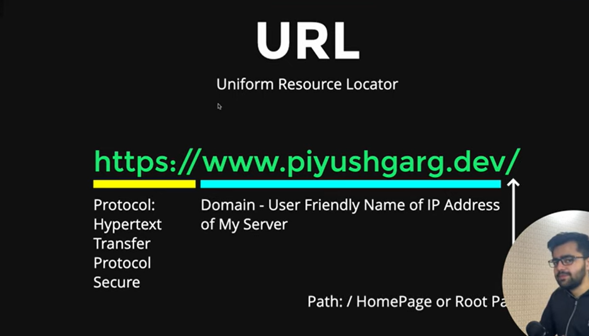

# URL module

### URL - Uniform Resource Locator

The URL module splits up a web address into readable parts.

Parse an address with the url.parse() method, and it will return a URL object with each part of the address as properties:

